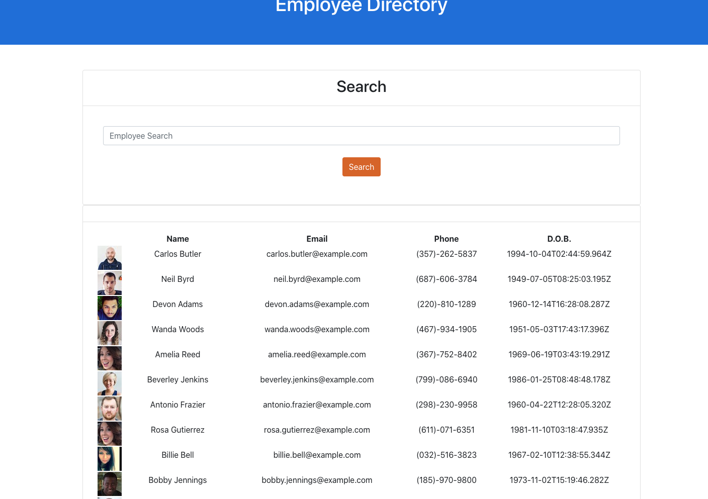
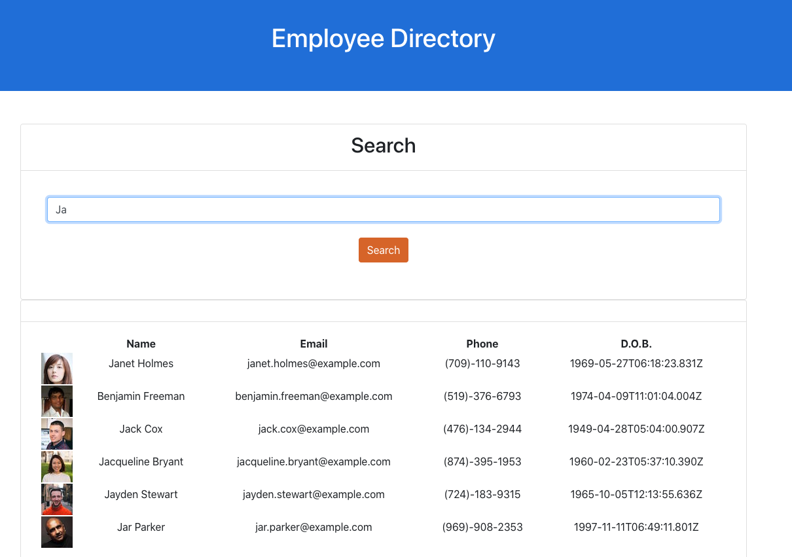

# React Employee Directory

## Description 

Employee directory using React with seperate UI components

                

## Table of Contents
                                           
* [Installation](#installation)
* [Usage](#usage)
* [Testing](#tests)
* [Contributing](#contributing)
* [License](#license)
* [Notes](#notes)
* [Questions](#questions)
                    
## Installation
                      

                     
## Usage 
                      

## Tests
                      
undefined

## Contributing
                      
undefined
                    
## License
                      
Project license: MIT

## Notes

                                                        
## Questions
Let me know if you have any questions! Check out my [GitHub Profile](https://github.com/davidnjaffe)                 
Or email me @ <davidnjaffe@gmail.com>
                      
